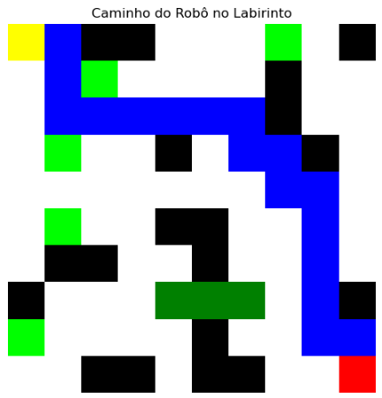

# 🤖 Navegação Inteligente em Labirinto com Algoritmo A*

Este projeto aplica uma abordagem simbólica de Inteligência Artificial (IA) para resolver um problema de navegação em um labirinto utilizando o algoritmo A* (A-Star). O objetivo é conduzir um robô da posição inicial (1,1) até a posição final (10,10), enfrentando desafios como obstáculos, consumo de energia e pontos de regeneração parcial.

## 🧠 Objetivo

Simular o comportamento inteligente de um agente (robô) em um ambiente com restrições de movimento e energia, utilizando uma estratégia de busca heurística (A*) para encontrar o caminho mais eficiente até o objetivo.

## ⚙️ Funcionamento

### 🔋 Regras do Robô

- **Início:** Posição (0,0) com 50 unidades de energia.
- **Movimento:** Perde 1 unidade de energia por passo.
- **Recarga:**
  - Células verdes claras: +5 de energia.
  - Células verdes escuras: +10 de energia.
- **Objetivo:** Chegar à posição (9,9).
- **Movimentos possíveis:** Cima, baixo, esquerda, direita.
- **Se a energia zerar antes de chegar ao objetivo, o robô falha.**

### 🧱 Regras do Labirinto

- **Tamanho:** 10x10.
- **Obstáculos:** Entre 15 e 35 células aleatórias são impassáveis.
- **Recarga de Energia:**
  - 5 células fornecem +5 de energia.
  - 3 células fornecem +10 de energia.
- **Início e fim do percurso nunca são ocupados por obstáculos ou recargas.**

## 🧮 Algoritmo A*

- Utiliza **heurística de distância de Manhattan** para estimar o custo restante.
- Gerencia **consumo e regeneração de energia** a cada movimento.
- Retorna o **caminho mais eficiente**, se possível, considerando as restrições de energia.

## 🖼️ Visualização

A função `plot_maze()` exibe uma imagem do labirinto com:

| Elemento         | Cor        |
|------------------|------------|
| Início           | 🟨 Amarelo  |
| Objetivo         | 🟥 Vermelho |
| Caminho percorrido | 🟦 Azul     |
| Obstáculos       | ⬛ Preto    |
| Energia +5       | 🟩 Verde claro |
| Energia +10      | 🟩 Verde escuro |
| Espaços livres   | ⬜ Branco   |

## 📦 Estrutura do Projeto

- `generate_maze()`: Gera o labirinto com obstáculos e pontos de energia.
- `heuristic(a, b)`: Calcula a distância de Manhattan.
- `astar(maze)`: Executa o algoritmo A* com lógica de energia.
- `plot_maze(maze, path)`: Exibe o labirinto e o caminho encontrado.
- `main`: Gera o labirinto, executa o A*, plota o resultado e imprime o relatório final.

## 📈 Exemplo de Execução



```txt
✅ Caminho encontrado!
🔢 Passos: 19
⚡ Energia restante: 32
📍 Caminho: (0, 0) -> (0, 1) -> (1, 1) -> (2, 1) -> (2, 2) -> (2, 3) -> (2, 4) -> (2, 5) -> (2, 6) -> (3, 6) -> (3, 7) -> (4, 7) -> (4, 8) -> (5, 8) -> (6, 8) -> (7, 8) -> (8, 8) -> (8, 9) -> (9, 9)
```

## 🐍 Requisitos

- Python 3.6+
- matplotlib
- numpy

Instale com:

```bash
pip install matplotlib numpy
```

---
## 📁 Como Executar na sua máquina! 
Primeiro passo é criar uma nova pasta em seu caminho de preferência! 

```bash
cd C:/
mkdir projeto_a3_IA
cd projeto_a3_IA
```

Após criar uma pasta chamada *projeto_a3_IA* dentro da sua máquina você pode fazer o processo de clone do repositório que está no Github.

```bash
git clone https://github.com/Japu431/A3-Inteligencia_Artificial
cd A3-Inteligencia_Artificial
```
Agora é só abrir na sua IDE de preferência para executar o nosso script.
(Caso você utilize o Visual Studio Code, você pode executar o próximo script bash abaixo)

```bash
code.
```

Para executar o nosso arquivo Python, vá no terminal e execute:

```bash
modelo_IA.py
```

Caso esteja utilizando um notebook para executar, é apenas abrir o arquivo e executar as células

```bash
modelo_IA.ipynb
```

---
## 🧠 Conceitos Aplicados
- Inteligência Artificial Simbólica
- Algoritmo A* (Busca Heurística)
- Gerenciamento de recursos (energia)
- Geração procedural de ambientes
- Visualização com matplotlib


---
## ✍️ Autores

<table>
  <tr><td>👩‍💻 <strong>Anabelly Salles</strong></td><td>RA: 824129970</td></tr>
  <tr><td>👨‍💻 <strong>Diego Vinicius</strong></td><td>RA: 12523158675</td></tr>
  <tr><td>👨‍💻 <strong>Jhonattan Mariano</strong></td><td>RA: 824120739</td></tr>
  <tr><td>👨‍💻 <strong>João Gobbi</strong></td><td>RA: 824145710</td></tr>
  <tr><td>👩‍💻 <strong>Julia Cristina Araujo</strong></td><td>RA: 823157679</td></tr>
  <tr><td>👨‍💻 <strong>Matheus Yusuke</strong></td><td>RA: 825146805</td></tr>
  <tr><td>👨‍💻 <strong>Nicolas Trindade</strong></td><td>RA: 824135758</td></tr>
</table>
